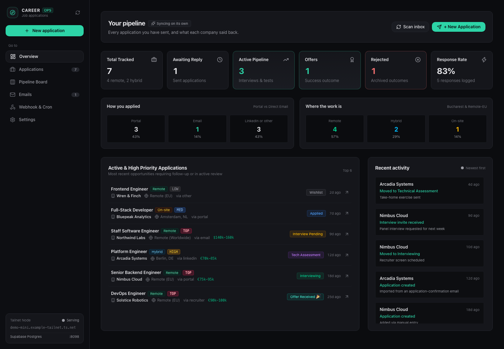
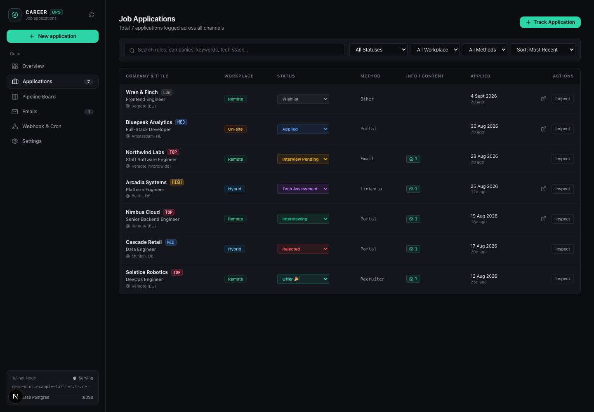
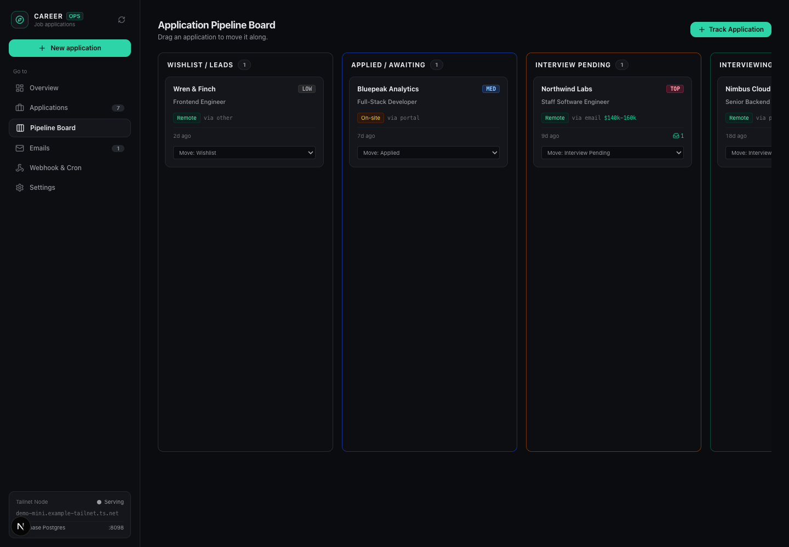
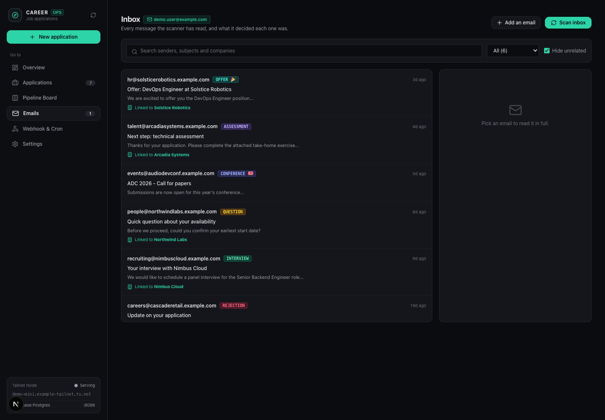
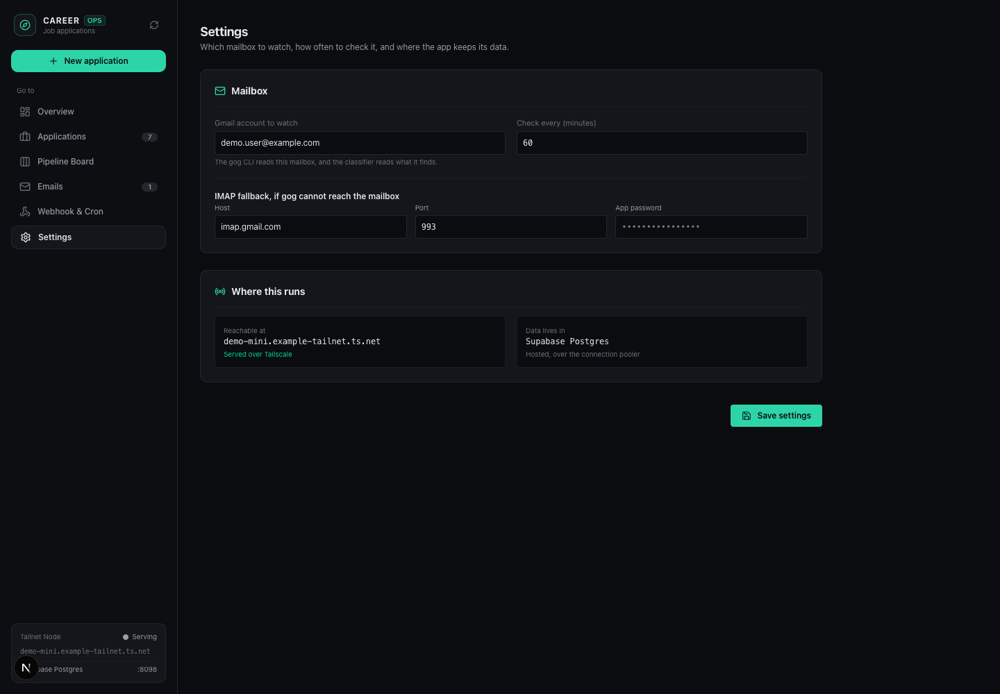
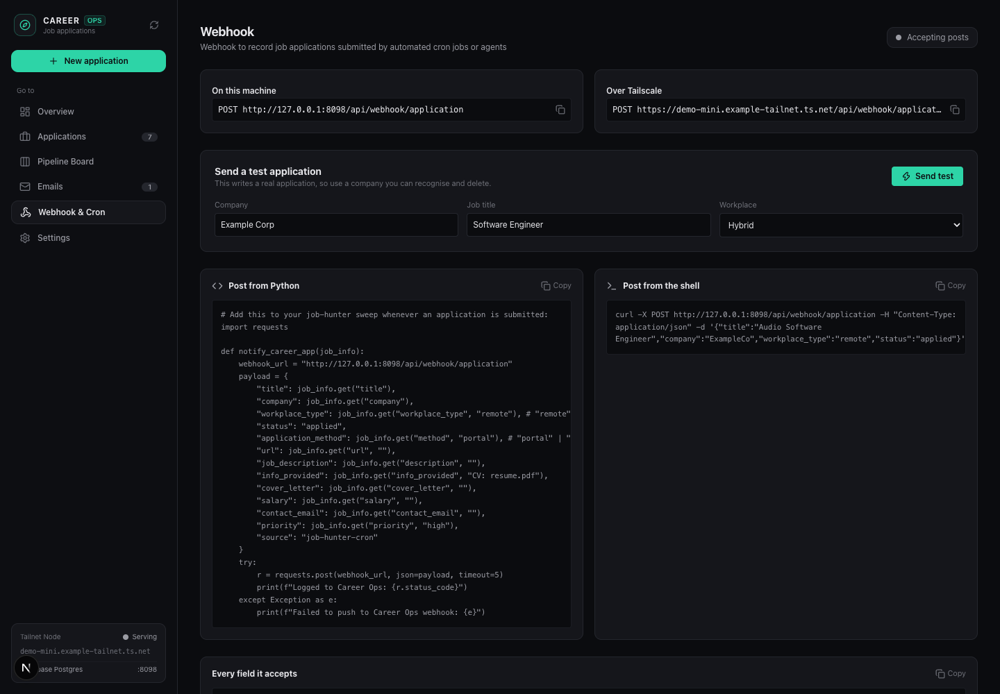

# Career

A job-application tracker with an **Email Radar** that reads Gmail, works out
what each reply actually means, and moves applications through a pipeline
without manual data entry.

Runs locally on port `8098`, backed by Postgres. Single user, no auth — it is
built to run as one person's private instance, not a multi-tenant service, so
it is not meant to be exposed publicly on the open internet.

Every screenshot below is seeded demo data (fake companies, a `demo.user@example.com`
inbox) — nothing here is a real application or a real inbox.



- [Stack](#stack)
- [Screenshots](#screenshots)
- [Running it](#running-it)
- [Deploying](#deploying)
- [Data model](#data-model)
- [Email Radar](#email-radar)
- [HTTP API](#http-api)
- [Scripts](#scripts)

## Stack

| Piece | Choice |
| --- | --- |
| Framework | Next.js 16 (App Router, Turbopack) |
| UI | React 19, Tailwind v4, `lucide-react` |
| Database | Postgres via `pg` |
| Gmail access | the `gog` Google Workspace CLI, shelled out from the scanner |

There is no ORM and no API-client layer for reads: most routes call `query()`
from `src/lib/db.ts` directly (Prisma covers the CRUD write side — see
`src/lib/prisma.ts`), and the client fetches its own routes.

## Screenshots

| | |
| --- | --- |
|  |  |
|  |  |

The webhook tab, for logging applications submitted by an external script or cron job:



## Running it

This app has exactly one owner. That identity is not hardcoded — it comes from
environment variables, so the same source can run as anyone's private instance:

| Variable | Used for | Required? |
| --- | --- | --- |
| `OWNER_EMAIL` | `src/lib/owner.ts` fallback for the Gmail account, and the blacklist entry that keeps the classifier from mistaking your own sent mail for a lead (`src/lib/email/status.ts`) | No — falls back to `owner@example.com`, and `email_settings.gmail_account` wins over it anyway once set via the Settings tab |
| `OWNER_NAME` | Same blacklist, and a guard in `src/lib/email/extract.ts` that stops your own name from being misparsed as a company | No — the guards just no-op when unset |
| `NEXT_PUBLIC_TAILSCALE_URL` | A second copyable webhook URL shown in the Webhook tab when this instance is reachable over Tailscale (`src/components/WebhookView.tsx`) | No — the Tailscale card just stays hidden |

Postgres connection comes from the standard `PG*` environment variables. Every
one has a local-dev default, so an out-of-the-box local Postgres needs no config:

| Variable | Default |
| --- | --- |
| `PGHOST` | `127.0.0.1` |
| `PGPORT` | `5432` |
| `PGUSER` | `postgres` |
| `PGPASSWORD` | `postgres` |
| `PGDATABASE` | `career` |

Set them, along with the owner variables above, in `.env.local` (git-ignored)
for anything other than the Postgres defaults — `.env.example` has the full
list with explanations, including the Supabase/Cloudflare variables the
deployed instance additionally needs (see [Deploying](#deploying)).

**A word of caution on `DATABASE_URL`:** if it's set, `src/lib/prisma.ts` uses
it and ignores every `PG*` variable above — it does not compose with them.
Leave it unset for a plain local Postgres; set it only when pointing at a
pooler (e.g. Supabase) that the `PG*` vars alone can't express.

```bash
createdb career
psql career -f src/lib/schema.sql   # idempotent: CREATE TABLE IF NOT EXISTS + ALTER ... IF NOT EXISTS

npm install
npm run dev                         # http://localhost:8098
```

Production-ish, as it runs on the Mac mini:

```bash
npm run build
scripts/start.sh                    # nohup npm start, logs to logs/server.log
scripts/stop.sh
```

Gmail scanning additionally needs `gog` on `PATH` and an authorised account:

```bash
gog auth login          # or: gog auth add <email>
```

The account defaults to the one stored in `email_settings`; when the token
expires the scan does not fail silently — the API returns the re-auth
instruction in `errors[]` and the UI shows it in a banner.

## Deploying

`main` is deployed automatically by `.github/workflows/deploy.yml`. On every PR:
`verify` (lint, OpenAPI lint, build type-gate, tests) and `security`
(`audit-ci` dependency scan against `audit-ci.jsonc`). On every push to `main`,
after both pass: `supabase` (migrations, edge function, Cloudflare secrets) then
`deploy` (Tailscale + SSH redeploy on the Mac mini, which ends with a health
check). Third-party actions are pinned to commit SHAs and kept current by
Dependabot (`.github/dependabot.yml`). Setup, first run, and rollback are in
[`docs/deploy.md`](docs/deploy.md).

## Data model

`src/lib/schema.sql` is the source of truth and is safe to re-run.

- **`applications`** — one row per role. `status` is one of `wishlist`,
  `applied`, `interview_pending`, `interviewing`, `technical_assessment`,
  `offer`, `rejected`, `archived`.
- **`application_events`** — append-only timeline (status changes, detected
  emails, auto-created applications).
- **`email_logs`** — every scanned message with its `classification` and a
  `manual_override` flag.
- **`email_settings`** — single-row config for the Gmail account and IMAP
  fallback fields.

## Email Radar

The scanner (`src/lib/email-scanner.ts`) searches Gmail through `gog`, hydrates
message bodies, classifies each one, matches it to an existing application (or
creates one), and advances that application's status.

Two rules keep it from making a mess of the pipeline:

- **Status never rewinds.** Transitions are ranked, so a confirmation that
  arrives after an interview invitation cannot drag the application back to
  `applied`. `rejected` is exempt — it can arrive at any stage and always wins.
- **Human corrections are permanent.** Changing a classification in the UI sets
  `manual_override`, and rescans skip those rows entirely.

Classification itself is documented separately, including how to evaluate
changes against the stored corpus before shipping them:

**→ [`docs/email-classifier.md`](docs/email-classifier.md)**

## HTTP API

| Route | Method | Purpose |
| --- | --- | --- |
| `/api/applications` | `GET`, `POST` | List and create applications |
| `/api/applications/[id]` | `GET`, `PATCH`, `DELETE` | Read, update, remove one |
| `/api/stats` | `GET` | Counts, funnel and recent events for the overview |
| `/api/email/logs` | `GET`, `PATCH` | Scanned mail; `PATCH` records a manual classification |
| `/api/email/scan` | `GET`, `POST` | `GET` runs a Gmail scan; `POST` ingests one message |
| `/api/email/reanalyze` | `POST` | Re-classify one email, or every email on an application |
| `/api/email/settings` | `GET`, `PATCH` | Gmail/IMAP settings |
| `/api/follow-ups` | `POST` | Create a custom (non-email) follow-up item |
| `/api/webhook/application` | `GET`, `POST` | Ingest an application from an external source |
| `/api/openapi`, `/api/docs` | `GET` | The OpenAPI 3.1 spec, and Swagger UI over it |

`/api/email/scan` returns `scannedCount`, `matchedCount`, `skippedCount` and
`newEmails[]`, plus a non-fatal `errors[]` — an empty result with a populated
`errors[]` means the scan was blocked, not that there was no mail.

The full contract — every field, status code and deliberate quirk — lives in
[`docs/openapi.yaml`](docs/openapi.yaml). `npm run lint:openapi` validates it
(also enforced in CI); a running instance serves Swagger UI at
[`/api/docs`](http://localhost:8098/api/docs).

## Scripts

| Script | What it does |
| --- | --- |
| `scripts/eval-classifier.ts` | Re-classifies every stored email and diffs against what is saved. Run before and after any classifier change. |
| `scripts/debug-classify.ts` | Prints the full rule trace for one stored email. |
| `scripts/backfill-html-bodies.ts` | One-off: flattens `email_logs.snippet` rows that were stored as raw HTML. |
| `scripts/notify-career-app.py` | Webhook notifier used by cron. |

These are standalone Node scripts run directly (`node scripts/eval-classifier.ts`)
and are excluded from the Next build's `tsconfig.json`.
